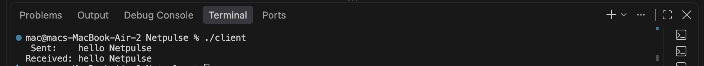

# Netpulse

A UDP latency load tester: it pushes a network path with a controlled, rising
stream of packets and measures exactly how and when the path starts to degrade.

## What it does

Netpulse sends UDP packets to an echo server at a configurable rate, times the
round trip of every single packet, and steps the send rate up until the path
saturates. Rather than averaging, it records *every* round-trip time, so it can
report tail latency, the behaviour that actually matters under load.

## Why

Every network path has a breaking point. Under light traffic it's fast and
lossless; as traffic rises, internal queues fill until latency spikes and packets
drop. That transition is sudden, not gradual. Netpulse is a controlled experiment
to find that point. I's the same question capacity planning and load testing ask of
real systems.

## What it measures

- **Latency percentiles (p50 / p95 / p99)** — the median and, critically, the tail.
- **Jitter** — variation in inter-packet delay (RFC 3550).
- **Loss rate** — the fraction of packets that never return.
- **The knee** — the load level where p99 and loss turn sharply upward while p50
  still looks fine.

## Architecture

The hot path is C++; the orchestration around it is Python.

- **C++ core** — the send/receive loop, per-packet timestamping, RTT storage, and
  percentile math. C++ is used here for *measurement fidelity*: at thousands of
  packets per second, an interpreted runtime's pauses would be recorded as network
  latency. A tight, predictable C++ loop keeps the numbers honest.
- **Python orchestration** — runs the C++ core at each rate in the sweep, collects
  the results, and produces the plots and summary. It is not timing-sensitive,
  so Python's convenience costs nothing.

The load generator is **open-loop**: it sends at a fixed rate regardless of what
comes back, which is what lets queues build and the knee appears.

## Roadmap

- [x] **Phase 0** — UDP echo round-trip in C++ (proves a packet can make the trip)
- [ ] **Phase 1** — per-packet RTT timing
- [ ] **Phase 2** — load loop + p50 / p95 / p99 at a single rate
- [ ] **Phase 3** — rate sweep (100 → 5000 pps) + Python plots
- [ ] **Phase 4** — jitter, loss, and the results writeup

## Build & run (Phase 0)

```bash
g++ src/echo_server.cpp -o echo_server
g++ src/client.cpp -o client

./echo_server        # terminal 1 — stays running, waiting for packets
./client             # terminal 2 — sends one packet, prints the reply
```

## Status

**Phase 0 complete** — UDP echo verified end to end.


